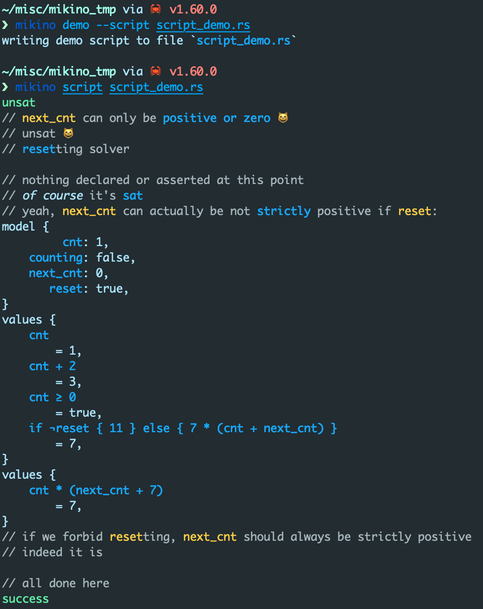
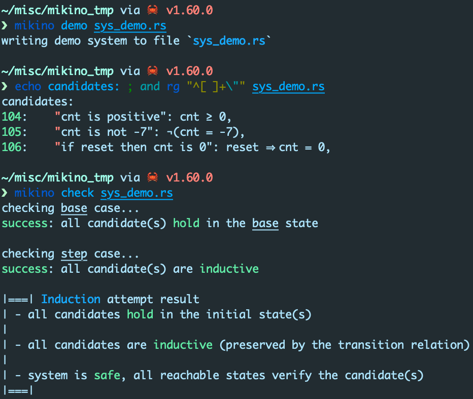
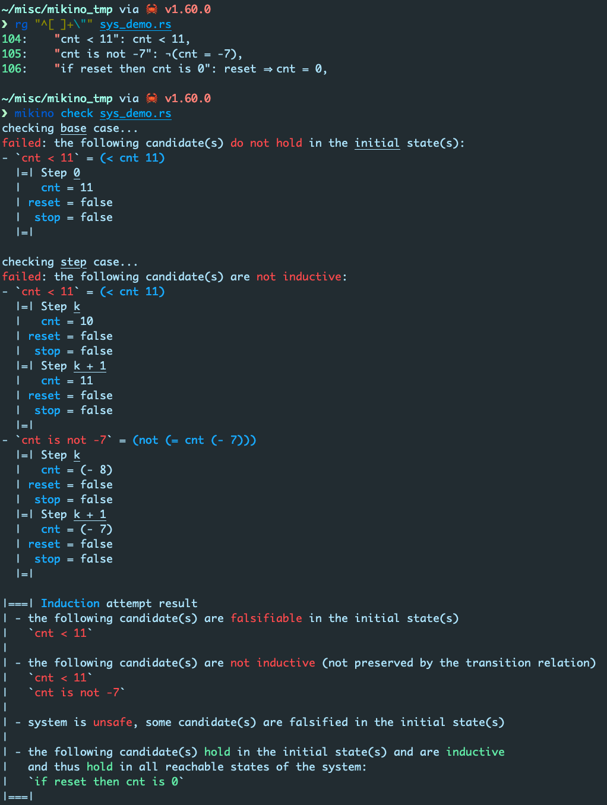

Mikino is a (relatively) simple induction and BMC engine. Its goal is to serve as a simple yet
interesting tool for those interested in formal verification, especially SMT-based induction. For
instance, mikino as an input language much easier to get into than SMT-LIB 2 (the SMT solver input
language standard). Also, we took great care in making its output as readable and easy to understand
as possible.


Mikino comes with [a tutorial on SMT, induction (and strengthening)][dummies]. Definitely read it if
you're new to either of these topics, or just take a look at the examples throughout to get a taste
of mikino. See the [gallery](#gallery) for screenshots of mikino's awesome output.

> *"Mikino"* does **not** mean *cinema*. It is a contraction of *"mini"* and *"kinō"* (帰納:
> induction, recursion). It is a significantly simpler version of the now defunct [kino]
> `k`-induction engine on transition systems.

Contents:
- [Installing](#installing)
- [Basics](#basics)
- [SMT Solver (Z3)](#smt-solver-z3)
- [Building From Source](#building-from-source)
- [Transition Systems](#transition-systems)
- [Scripts](#scripts)
- [Dependencies](#dependencies)
- [Gallery](#gallery)
- [License](#license)


# Installing

Make sure Rust is installed and up to date.

```bash
> rustup update
```

Use cargo to install mikino.

```bash
> cargo install mikino
```

That's it. Alternatively, you can [build it from source](#building-from-source).

```bash
> mikino -V
mikino 0.9.0
```


# Basics

You can run mikino in demo mode with `mikino demo demo.mkn`. This will write a heavily commented
example system in `demo.mkn`. There is a discussion on transition systems
[below](#transition-systems) that goes into details on the input format, using this exact system as
an example.

Running `mikino help` is also probably a good idea.

Note that mikino files are designed to work well with Rust syntax highlighting.


# SMT Solver (Z3)

Mikino requires an [SMT solver] to run induction (and BMC). More precisely, it requires [Z3] which
you can download directly from the [Z3 release page]. You must either

- make sure the Z3 binary is in your path, and is called `z3`, or
- use mikino's `--z3_cmd` to specify how to call it, for instance:
    - `mikino --z3_cmd my_z3 ...` if `my_z3` is in your path, or
    - `mikino --z3_cmd ./path/to/my_z3 ...` if `path/to/my_z3` is where the Z3 binary is.


# Building From Source

```bash
> cargo build --release
> ./target/release/mikino --version
mikino 0.9.0
```


# Transition Systems

> See the [gallery](#gallery) for screenshots of mikino's awesome output.

A (transition) system is composed of some variable declarations, of type `bool`, `int` or `rat`
(rational). A valuation of these variables is usually called a *state*. (An `int` is a
*mathematical* integer here: it cannot over/underflow. A `rat` is a fraction of `int`s.)

> Let's use a simple counter system as an example. Say this system has two variables, `cnt` of type
> `int` and `inc` of type bool.

The definition of a system features an *initial predicate*. It is a boolean expression over the variables of the system that evaluate to true on the initial states of the system.

> Assume now that we want to allow our counter's `cnt` variable's initial value to be anything as
> long as it is positive. Our initial predicate will be `cnt ≥ 0`. Note that variable `inc` is
> irrelevant in this predicate.

Next, the *transition relation* of the system is an expression over two versions of the variables:
the *current* variables, and the *next* variables. The transition relation is a relation between
the current state and the next state that evaluates to true if the next state is a legal successor
of the current one. A the *next* version of a variable `v` is written `'v`, and its *current*
version is just written `v`.

> Our counter should increase by `1` whenever variable `inc` is true, and maintain its value
> otherwise. There is several ways to write this, for instance
>
> ```rust
> (inc ⋀ 'cnt = cnt + 1) ⋁ (¬inc ⋀ 'cnt = cnt)
> ```
>
> or
>
> ```rust
> if inc { 'cnt = cnt + 1 } else { 'cnt = cnt }
> ```
>
> or
>
> ```rust
> 'cnt = if inc { cnt + 1 } else { cnt }
> ```

Last, the transition system has a list of named candidates (*candidate invariants*) which are
boolean expressions over the variables. The system is **safe** if and only if it is not possible to
reach a falsification of any of these candidates from the initial states by applying the transition
relation repeatedly.

> A reasonable candidate for the counter system is `(≥ cnt 0)`. The system is safe for this
> candidate as no reachable state of the counter can falsify it.
>
> The candidate `¬(cnt = 7)` does not hold in all reachable states, in fact the initial state `{
> cnt: 7, inc: _ }` falsifies it. But assume we change the initial predicate to be `cnt = 0`. Then
> the candidate is still falsifiable by applying the transition relation seven times to the (only)
> initial state `{ cnt: 0, inc: _ }`. In all seven transitions, we need `inc` to be true so that
> `cnt` is actually incremented.

A falsification of a candidate is a *concrete trace*: a sequence of states *i)* that starts from an
initial state, *ii)* where successors are valid by the transition relation and *iii)* such that the
last state of the sequence falsifies the PO.

> A falsification of `¬(cnt = 7)` for the last system above with the modified initial predicate
> is
>
> ```
> Step 0
> | cnt: 0
> Step 1
> | cnt: 1
> | inc: true
> Step 2
> | cnt: 2
> | inc: true
> Step 3
> | cnt: 3
> | inc: true
> Step 4
> | cnt: 4
> | inc: true
> Step 5
> | cnt: 5
> | inc: true
> Step 6
> | cnt: 6
> | inc: true
> Step 7
> | cnt: 7
> | inc: true
> ```


# Scripts

> See the [gallery](#gallery) for screenshots of mikino's awesome output.

Mikino also has a `script` mode which runs scripts in Rust-flavored SMT-LIB 2. The syntax is very
similar to that of transition system, check out the demo by running `mikino demo --script
demo_script.rs`.


# Dependencies

Mikino relies on the following stellar libraries:

- [`ansi_term`](https://crates.io/crates/ansi_term)
- [`atty`](https://crates.io/crates/atty)
- [`clap`](https://crates.io/crates/clap)
- [`mikino_api`](https://crates.io/crates/mikino_api)

- [`either`](https://crates.io/crates/either)
- [`error-chain`](https://crates.io/crates/error-chain)
- [`lazy_static`](https://crates.io/crates/lazy_static)
- [`num`](https://crates.io/crates/num)
- [`peg`](https://crates.io/crates/peg)
- [`readonly`](https://crates.io/crates/readonly)
- [`rsmt2`](https://crates.io/crates/rsmt2)


# Gallery

Generate and run demo script. All lines starting with `//` in the output are `echo!`-s from the script:



Generate and run the demo transition system:



Run on a modified (unsafe) version of the demo system:




# License

Mikino is distributed under the terms of both the MIT license and the Apache License (Version 2.0).

See [LICENSE-APACHE][apache] and [LICENSE-MIT][mit] for details.

-------

Copyright © OCamlPro SAS

[SMT solver]: https://en.wikipedia.org/wiki/Satisfiability_modulo_theories
(SMT on wikipedia)
[Z3]: https://github.com/Z3Prover/z3/wiki
(Z3's wiki on github)
[Z3 release page]: https://github.com/Z3Prover/z3/releases
(Z3's release page on github)
[kino]: https://github.com/kino-mc/kino
(kino on github)
[apache]: https://github.com/AdrienChampion/mikino_bin/blob/master/LICENSE-APACHE
(Apache 2.0 license on github)
[mit]: https://github.com/AdrienChampion/mikino_bin/blob/master/LICENSE-MIT
(MIT license on github)
[release page]: https://github.com/OCamlPro/mikino_bin/releases
(Mikino's release page on github)
[dummies]: https://ocamlpro.com/blog/2021_10_14_verification_for_dummies_smt_and_induction
(Induction for Dummies: SMT and Induction)
